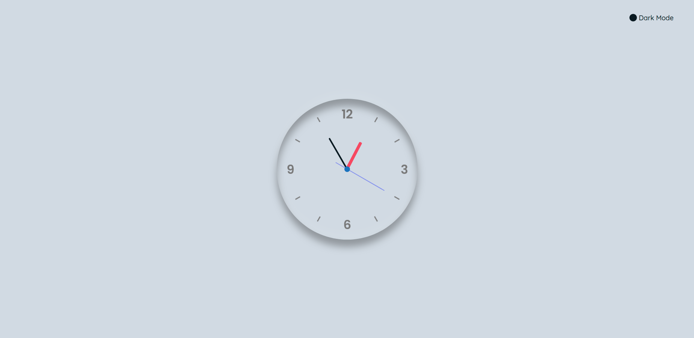
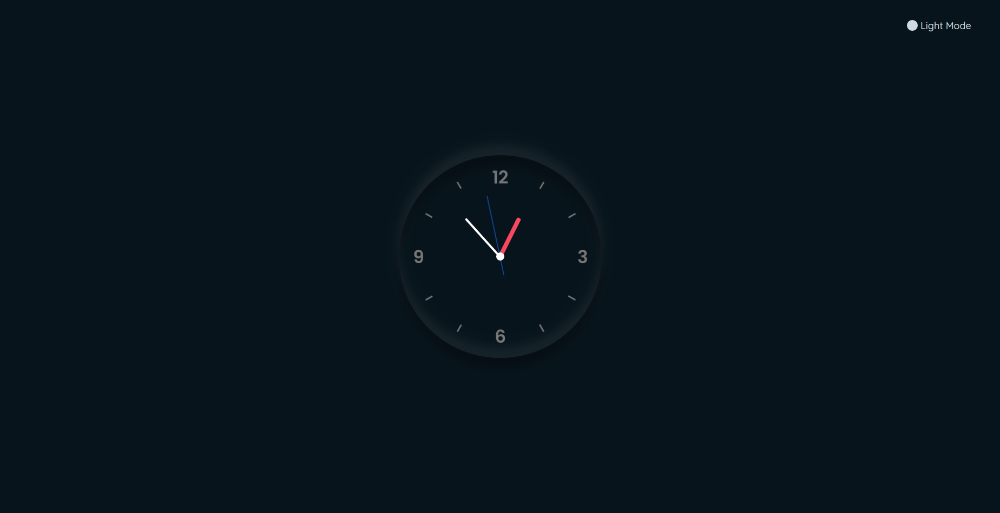

# Analog Clock

### This website is deployed [here.](https://rajatkhatri7.github.io/CLOCK/)

### *Features*:
* User-friendly
* Displays current Time
* Neomorphic Interface 
* Added Themes: Dark Mode <-> Light Mode

## *Technologies used*

- HTML5
- CSS3 (with Flexbox)
- Vanilla Javascript

## *References*
* For Fonts: [Google Fonts](https://fonts.googleapis.com/css2?family=Work+Sans:wght@300&display=swap)
* For Color Coordination: [w3schools](https://www.w3schools.com/colors/colors_mixer.asp?colorbottom=000000&colortop=FFFFFF)
* For Date and Time function: [Date and Time JS](https://javascript.info/date#setting-date-components)
* For Neomorphism: [Writing CSS for Neomorphism](https://www.youtube.com/watch?v=Gv0dy51SYL0)
* Help for Neomorphism: [Neomorphism](https://neumorphism.io/)
* More about Neomorphism: [CSS-tricks](https://css-tricks.com/neumorphism-and-css/)

## Website Demo:

# *Author*
* Rajat Khatri (rajatkhatri7, rajatkhatri0002@gmail.com)
   
